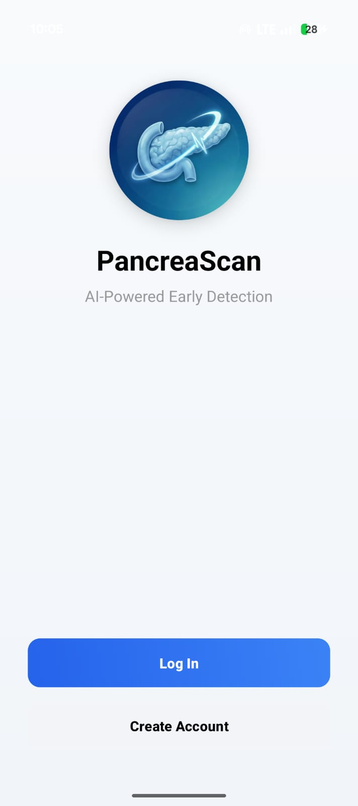
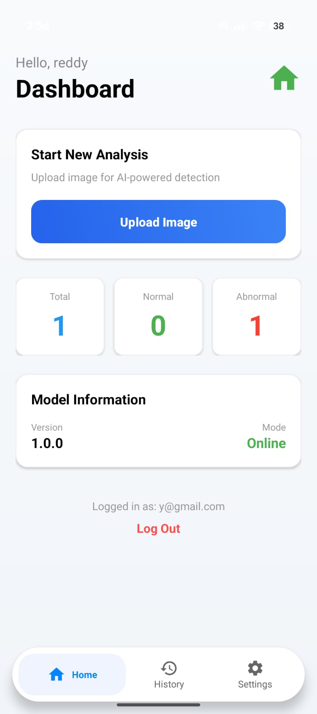
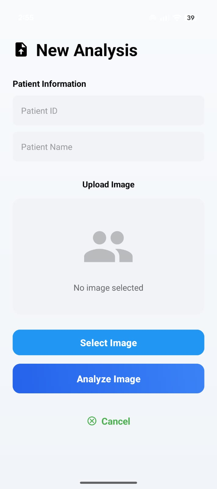
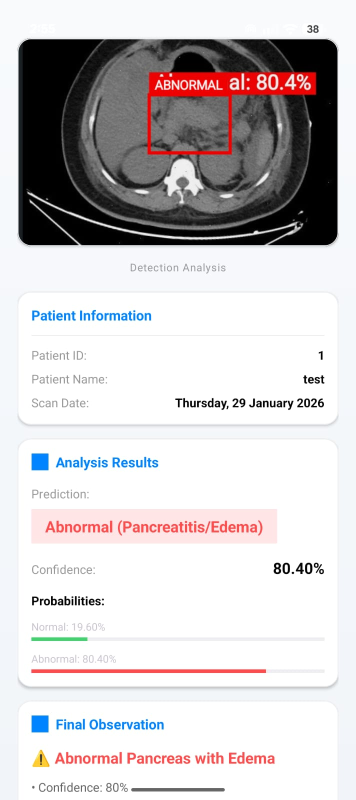
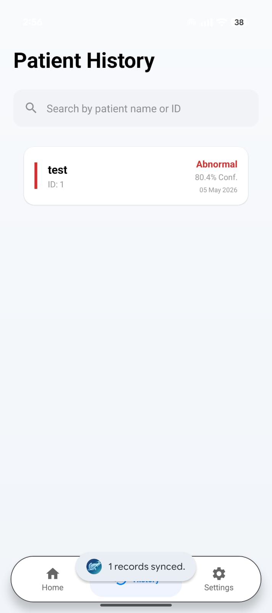

# 🧠 PancreaScan

### AI-Powered Detection of Peripancreatic Fluid Collections in Pancreatitis using 128-Slice CT Abdomen

<p align="center">
  
</p>

<h3 align="center">
AI-Powered Pancreatic Condition Detection using Federated Learning
</h3>

---

## 📌 Overview

PancreaScan is an advanced AI-powered Android application developed for detecting pancreatic edema and pancreatitis from CT scans using Federated Learning and on-device Artificial Intelligence.

Unlike traditional cloud-based AI diagnostic systems, PancreaScan performs intelligent medical analysis directly on the mobile device using TensorFlow Lite, enabling fast, secure, and privacy-preserving healthcare diagnostics.

The application is designed with a privacy-first architecture where patient CT scans remain on-device while only encrypted model updates are synchronized through the federated learning pipeline.

PancreaScan supports:
- ⚡ Real-time AI-powered CT scan analysis
- 🔁 Federated Learning workflow
- 📡 Offline diagnosis capability
- 🔒 Privacy-preserving medical AI
- 🌐 Backend synchronization support
- 📄 Smart diagnostic reporting
- 🗂️ Patient history management

This enables intelligent pancreatic abnormality detection even in resource-constrained or low-connectivity healthcare environments.

---

## 🚀 Key Features

- 📷 AI-powered CT scan analysis
- 🤖 TensorFlow Lite-based prediction system
- 🔁 Federated Learning architecture
- 🔒 Privacy-preserving medical workflow
- ⚡ Instant on-device prediction
- 🌐 Backend synchronization support
- 📄 Automated diagnostic reporting
- 🗂️ Patient history management
- 📡 Offline functionality
- 📱 Modern Android UI/UX

---

## 🏗️ Architecture

```text
Android App → PHP Backend APIs → Python ML Pipeline → Prediction Output
```

---

## 📸 Screenshots

| Splash Screen | Authentication |
|----------------|----------------|
|  |  |

| Dashboard | New Analysis |
|------------|---------------|
|  |  |

| Patient Analysis | Patient History |
|------------------|-----------------|
|  |  |

---

## 📂 Project Structure

```text
PancreaScan/
├── app/
├── backend/
│   └── Deployment/
│       ├── PHP_Backend/
│       └── Python_Model/
├── gradle/
```

---

## 🧰 Tech Stack

### Mobile Development
- Android (Java/Kotlin)
- Android Studio
- XML UI

### Backend
- PHP
- REST APIs

### Machine Learning
- Python
- TensorFlow Lite
- Federated Learning

### Database & Tools
- MySQL
- Git & GitHub

---

## 🔄 Workflow

1. User uploads CT scan through Android app  
2. AI model analyzes scan locally on-device  
3. Backend synchronizes encrypted model updates  
4. Federated learning pipeline improves global model  
5. Prediction and diagnostic report are generated  

---

## 🔐 Privacy-by-Design

PancreaScan follows Federated Learning principles where:
- Raw patient CT scans never leave the device
- Only encrypted model updates are shared
- Patient privacy and medical confidentiality are preserved

---

## 📁 Backend Components

### PHP Backend
Handles:
- Authentication
- Database operations
- API communication
- Synchronization workflow

### Python ML Pipeline
Handles:
- Model training
- Federated learning updates
- Prediction workflow
- Server-side processing

---

## 🔗 Important Links

- Privacy Policy:  
  https://thanvi-reddy.github.io/PancreaScan-policy/Delete-data.html

- Delete Account Policy:  
  https://thanvi-reddy.github.io/PancreaScan-policy/Delete-data.html

---

## 👩‍💻 Author

**Yeturu Thanvi**  
 

---

## ⭐ Support

If you found this project interesting, consider giving it a ⭐ on GitHub.
